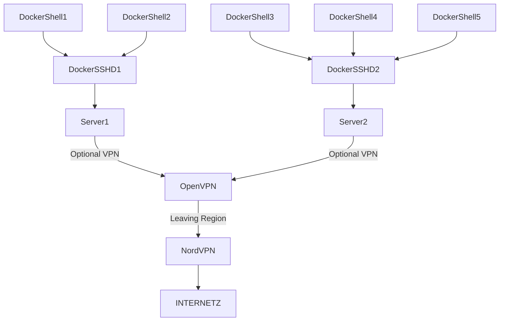

# l0pht

Regional Cluster design:


1. Server is running OpenSSH in a docker and shares /var/run/docker.sock with the OpenSSH-Docker instance. This allows to have just the docker_cli to be installed and spin up a shell for the user without having to run an extra docker-daemon (but using the docker-daemon from Server instead).
1. On small deployments the ```OpenVPN Server``` can be the same as Server[12]. This allows to run *everything* off 1 single server.
1. AWS Fargate could be utilized by nesting the entire setup in a Docker-in-Docker (dind) configuration.

Cluster can be deployed in various regions for less latency.
TODO:
1. https://docs.docker.com/engine/security/userns-remap/


Helpful links
1. https://github.com/nicolaka/netshoot
1. https://www.linuxserver.io/ and https://github.com/just-containers/s6-overlay
1. https://jordanelver.co.uk/blog/2019/06/03/routing-docker-traffic-through-a-vpn-connection/ 
1. https://hub.docker.com/r/alexaso/dnsmasq-dnscrypt and https://github.com/crazy-max/docker-cloudflared
2. https://wiki.archlinux.org/title/EncFS
3. https://www.supertechcrew.com/wetty-browser-ssh-terminal/

VPN Providers:
1. ProtonVPN
1. NordVPN
1. https://www.cryptostorm.is/

Hosting providers:
1. https://www.linode.com/
1. https://1984hosting.com/
