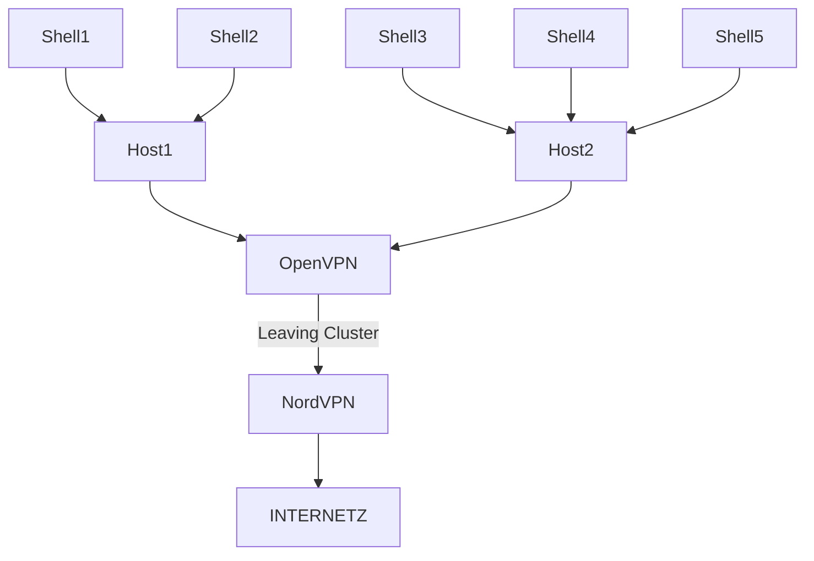

# l0pht

Regional Cluster design:

1. Host[12] are running SSHD with special shell that spawns a docker-shell for every new connection.
1. Host run vagrant VM??? 

Cluster can be deployed in various regions for less latency.

