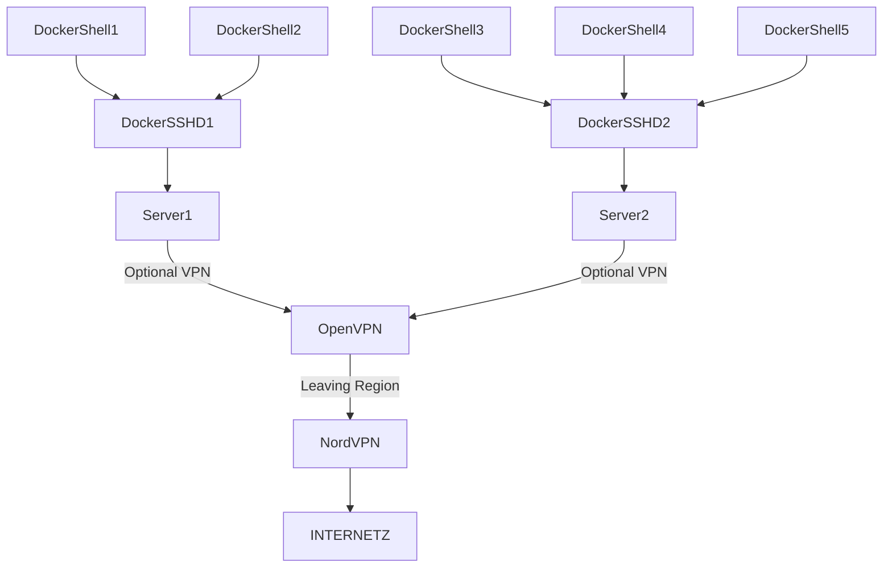

# l0pht

Regional Cluster design:


1. Server is running OpenSSH in a docker and shares /var/run/docker.sock with the OpenSSH-Docker instance. This allows to have just the docker_cli to be installed and spin up a shell for the user without having to run an extra docker-daemon (but using the docker-daemon from Server instead).
1. On small deployments the ```OpenVPN Server``` can be the same as Server[12]. This allows to run *everything* off 1 single server.
1. AWS Fargate could be utilized by nesting the entire setup in a Docker-in-Docker (dind) configuration.

Cluster can be deployed in various regions for less latency.

